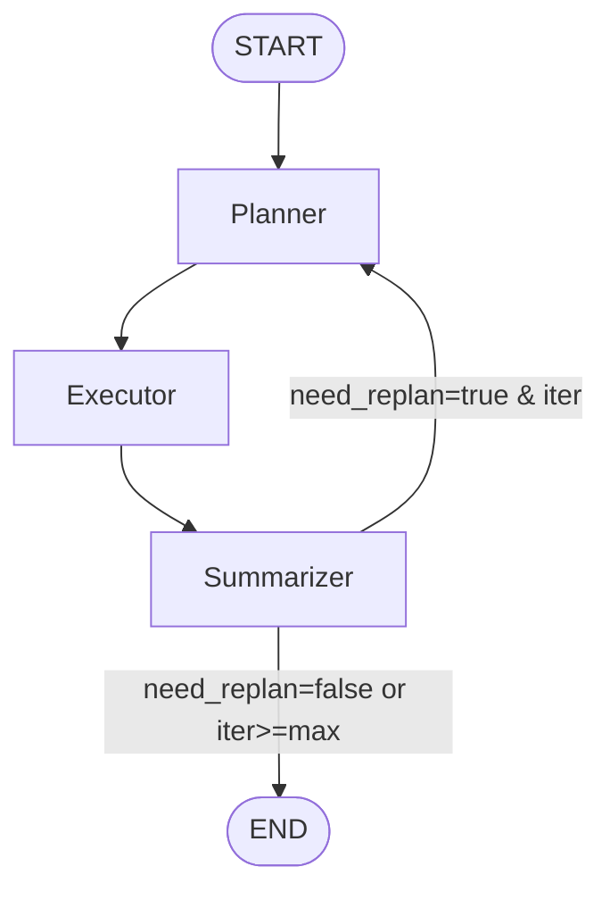

# replanning-logic Specification

## Purpose
TBD - created by archiving change implement-phase4-summarizer-module. Update Purpose after archive.
## Requirements
### Requirement: The system SHALL add Summarizer node to the...
The system SHALL add Summarizer node to the StateGraph

#### Scenario: Register Summarizer node
- **WHEN** Creating AgenticIQA StateGraph
- **THEN** it SHALL add Summarizer node:
```python
graph.add_node("summarizer", summarizer_node)
```
- **AND** node SHALL be registered after Planner and Executor nodes

#### Scenario: Update edge from Executor to Summarizer
- **WHEN** Defining graph edges
- **THEN** it SHALL connect Executor to Summarizer:
```python
graph.add_edge("executor", "summarizer")
```
- **AND** remove Phase 3 temporary edge from Executor to END

### Requirement: implement conditional edge function
The system SHALL implement conditional edge function for replanning decision

#### Scenario: Define conditional edge function
- **WHEN** Implementing replanning logic
- **THEN** it SHALL define `decide_next_node(state)` function:
```python
def decide_next_node(state: AgenticIQAState) -> Literal["planner", "__end__"]:
    """
    Conditional edge after Summarizer.

    Returns:
        "planner" if replanning needed and iterations < max
        "__end__" otherwise
    """
    summarizer_result = state.get("summarizer_result")
    if not summarizer_result:
        return "__end__"

    iteration = state.get("iteration_count", 0)
    max_iterations = state.get("max_replan_iterations", 2)

    if summarizer_result.need_replan and iteration < max_iterations:
        return "planner"

    return "__end__"
```

#### Scenario: Attach conditional edge to Summarizer
- **WHEN** Building graph
- **THEN** it SHALL attach conditional edge:
```python
graph.add_conditional_edges(
    "summarizer",
    decide_next_node,
    {
        "planner": "planner",
        "__end__": END
    }
)
```

### Requirement: The system SHALL initialize iteration tracking in state
The system SHALL initialize iteration tracking in state

#### Scenario: Initialize iteration_count
- **WHEN** Pipeline starts (run_pipeline function)
- **THEN** initial state SHALL include:
```python
initial_state = {
    "query": query,
    "image_path": image_path,
    "iteration_count": 0,
    "max_replan_iterations": max_iterations or 2
}
```

#### Scenario: Increment iteration_count on replan
- **WHEN** Summarizer sets need_replan=true
- **THEN** Summarizer SHALL increment iteration_count:
```python
new_iteration = state.get("iteration_count", 0) + 1
```
- **AND** return updated count in state

#### Scenario: Reset iteration_count not supported
- **WHEN** Replanning occurs
- **THEN** iteration_count SHALL NOT be reset within same pipeline execution
- **AND** only new pipeline invocations start at iteration_count=0

### Requirement: The system SHALL enforce maximum iteration limit
The system SHALL enforce maximum iteration limit

#### Scenario: Prevent infinite replanning loop
- **WHEN** iteration_count reaches max_replan_iterations
- **THEN** decide_next_node SHALL return "__end__"
- **AND** log warning: "Max replanning iterations reached"
- **AND** Summarizer SHALL not set need_replan=true (checked before)

#### Scenario: Configurable max iterations
- **WHEN** Running pipeline
- **THEN** it SHALL accept max_replan_iterations parameter (default=2)
- **AND** parameter SHALL be passed in initial state
- **AND** different tasks can use different limits

### Requirement: The system SHALL propagate Summarizer feedback to Planner...
The system SHALL propagate Summarizer feedback to Planner on replan

#### Scenario: Include replan_reason in state
- **WHEN** Replanning is triggered
- **THEN** state SHALL contain summarizer_result with replan_reason
- **AND** Planner node SHALL have access to previous iteration's context

#### Scenario: Append to replan_history
- **WHEN** Replanning occurs
- **THEN** replan_reason SHALL be appended to state["replan_history"]
- **AND** history entry SHALL include iteration number and reason
- **EXAMPLE**: `"[Iteration 1] Missing tool scores for vehicle region"`

#### Scenario: Planner adapts to feedback (optional enhancement)
- **WHEN** Planner receives state with replan_history
- **THEN** it MAY incorporate feedback into new plan generation
- **NOTE**: This is an optional enhancement, not required for Phase 4

### Requirement: The system SHALL update graph visualization to show...
The system SHALL update graph visualization to show replanning loop

#### Scenario: Mermaid diagram includes Summarizer
- **WHEN** visualize_graph is called
- **THEN** Mermaid diagram SHALL include:


#### Scenario: Visualization shows iteration limit
- **WHEN** Rendering graph diagram
- **THEN** conditional edge label SHALL indicate iteration limit check
- **AND** documentation SHALL explain max_replan_iterations parameter

### Requirement: log replanning flow
The system SHALL log replanning flow for debugging

#### Scenario: Log conditional edge decision
- **WHEN** decide_next_node is evaluated
- **THEN** it SHALL log:
  - need_replan value
  - Current iteration_count
  - max_replan_iterations
  - Decision: "planner" or "__end__"

#### Scenario: Log replanning trigger
- **WHEN** Replanning is triggered (decide_next_node returns "planner")
- **THEN** it SHALL log at INFO level:
  - "Replanning triggered: {replan_reason}"
  - "Iteration {iteration_count}/{max_replan_iterations}"

#### Scenario: Log max iterations reached
- **WHEN** Max iterations prevents replanning
- **THEN** it SHALL log at WARNING level:
  - "Max replanning iterations ({max_replan_iterations}) reached"
  - "Continuing with current evidence despite need_replan=true"

### Requirement: The system SHALL maintain state consistency during replanning
The system SHALL maintain state consistency during replanning

#### Scenario: Preserve previous outputs during replan
- **WHEN** Replanning occurs
- **THEN** previous plan and executor_evidence SHALL remain in state
- **AND** new plan SHALL overwrite old plan
- **AND** new executor_evidence SHALL overwrite old evidence
- **AND** summarizer_result SHALL be updated each iteration

#### Scenario: State size management
- **WHEN** Multiple replanning iterations occur
- **THEN** state SHALL not grow unbounded
- **AND** only current outputs SHALL be retained (not history of all iterations)
- **AND** replan_history SHALL have size limit (10 entries)

### Requirement: The system SHALL handle replanning edge cases
The system SHALL handle replanning edge cases

#### Scenario: Planner fails on replan
- **WHEN** Replanning triggers Planner but Planner returns error
- **THEN** pipeline SHALL catch error and return final state
- **AND** state["error"] SHALL contain error message
- **AND** iteration SHALL not increment further

#### Scenario: Executor fails on replan
- **WHEN** Replanning triggers new Executor run but Executor fails
- **THEN** Summarizer SHALL receive error in executor_evidence
- **AND** Summarizer MAY set need_replan=true again
- **AND** iteration limit SHALL prevent infinite error loops

#### Scenario: Summarizer repeatedly requests replan
- **WHEN** Summarizer sets need_replan=true on every iteration
- **THEN** max_replan_iterations SHALL enforce termination
- **AND** final summarizer_result SHALL have need_replan=true but not trigger further replanning
- **AND** log warning about potential logic issue in Summarizer

### Requirement: support running pipeline
The system SHALL support running pipeline without replanning

#### Scenario: Disable replanning
- **WHEN** Pipeline is called with max_replan_iterations=0
- **THEN** replanning SHALL be disabled
- **AND** decide_next_node SHALL always return "__end__"
- **AND** Summarizer MAY still set need_replan=true (for logging) but won't trigger replan

#### Scenario: Phase 3 compatibility
- **WHEN** Running pipeline without Summarizer node (hypothetical Phase 3 mode)
- **THEN** graph SHALL execute Planner → Executor → END
- **AND** no replanning logic SHALL be invoked

